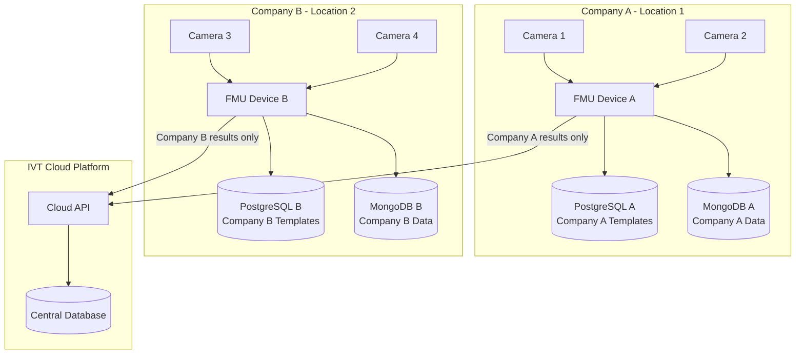
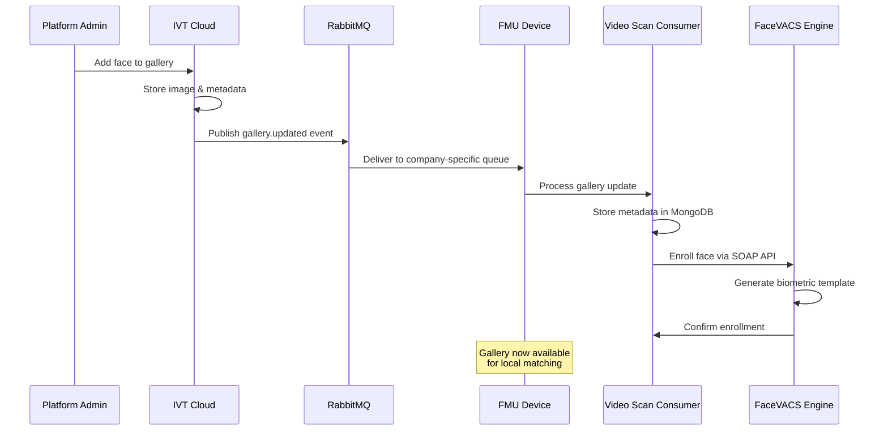
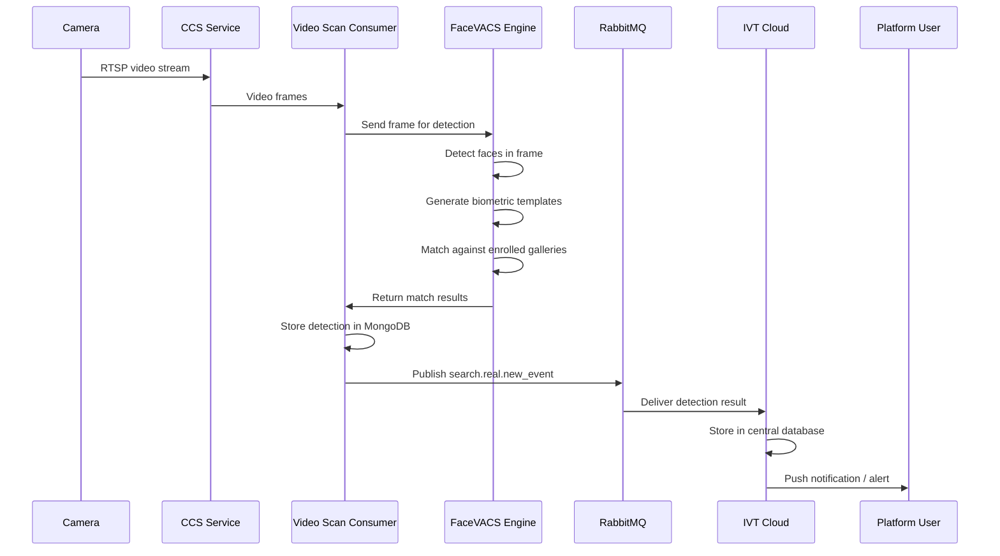
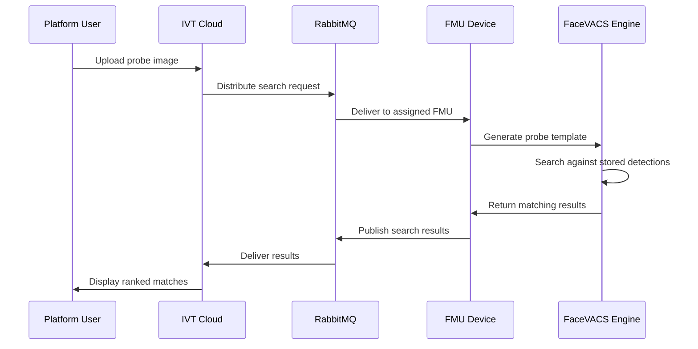

The IVT Platform combines cloud-based management with edge computing to deliver real-time facial recognition. This page explains the internal architecture -- how faces are detected, matched, and reported -- and how data isolation is enforced across tenants.

## The Cognetic Engine

All facial recognition in the IVT Platform is powered by the **Cognetic FaceVACS** engine. FaceVACS is a commercial biometric recognition platform purpose-built for high-throughput face identification in video surveillance environments. The platform communicates with FaceVACS through a SOAP/XML API, and each FMU device runs its own instance of **FaceVACS VideoScan** -- the real-time video processing component of the Cognetic platform.

<CardGroup cols={3}>
  <Card title="Face Detection and Template Generation" icon="face-viewfinder">
    FaceVACS detects faces within video frames and converts each detected face into a compact mathematical embedding (biometric template). These templates are the basis for all subsequent matching operations.
  </Card>
  <Card title="1:N Gallery Matching" icon="magnifying-glass-chart">
    Each detected face template is compared against all enrolled templates in the device's local galleries. FaceVACS returns ranked match candidates with confidence scores, enabling real-time identification against thousands of enrolled subjects.
  </Card>
  <Card title="Quality Scoring and Liveness" icon="shield-check">
    Before matching, FaceVACS evaluates image quality factors such as face angle, illumination, occlusion, and blur. Low-quality captures are filtered to reduce false matches and maintain recognition accuracy.
  </Card>
</CardGroup>

## FMU Software Stack

Each FMU (Field Management Unit) is a self-contained edge computing device running a full software stack. All services are containerized and managed via Docker Compose, allowing consistent deployment and straightforward updates.

| Component | Role |
|---|---|
| **FaceVACS VideoScan** | Cognetic's real-time face detection and matching engine -- the core biometric processor |
| **CCS (Camera Capture Service)** | Captures RTSP video frames from connected cameras and feeds them to the recognition pipeline |
| **Video Scan Consumer** | Orchestrates the processing pipeline: receives frames from CCS, sends to FaceVACS for matching, and publishes results |
| **PostgreSQL** | Stores Cognetic's internal biometric database (templates, enrollment data) |
| **MongoDB** | Stores gallery metadata, detection events, and operational data for the assigned company |
| **RabbitMQ** | Message broker for communication between FMU services and with the cloud platform |
| **Redis** | Caching layer for configuration, session data, and performance optimization |
| **Docker** | All services run as Docker containers, managed via docker-compose |

<Info>
  The FMU software stack is provisioned and updated remotely through the IVT Platform. Administrators do not need to manage individual containers or databases directly under normal operating conditions.
</Info>

## Data Isolation Architecture

The IVT Platform enforces strict per-company data isolation at the FMU level. Because biometric data is sensitive, the architecture ensures that no cross-tenant data access is possible at any layer.

- **Each FMU is assigned to exactly one company** -- it never processes data for multiple companies simultaneously.
- **Gallery data** -- Only the assigned company's face galleries are synced to the FMU. The device has no access to other companies' biometric data.
- **Detection results** -- All detections are tagged with the company ID and sent only to that company's cloud partition.
- **RabbitMQ queues** -- Company-specific message queues (e.g., `video-scan-company-{companyId}`) ensure data routing isolation.
- **MongoDB collections** -- All documents are filtered by `companyId`, preventing cross-tenant data access.
- **Physical separation** -- Because each FMU is a physical device at the company's premises, biometric data never leaves the company's local network for processing.

<Warning>
  FMU devices store biometric data locally. Ensure physical security of FMU hardware is maintained, and follow your organization's data protection policies for biometric information.
</Warning>

## Gallery Synchronization Flow

When an administrator adds or updates a face in a gallery through the cloud platform, the change is automatically propagated to the relevant FMU devices. The biometric template is generated on the FMU itself via the Cognetic engine, and the new face becomes available for matching within seconds.

<Steps>
  <Step title="Admin adds a face">
    A platform administrator uploads a face image to a gallery through the IVT web interface or API. The cloud stores the image and associated metadata.
  </Step>
  <Step title="Gallery update event is published">
    The cloud platform publishes a `gallery.updated` event to RabbitMQ, targeting the company-specific queue for the FMU devices assigned to that company.
  </Step>
  <Step title="FMU receives the update">
    The FMU's message consumer picks up the event from its dedicated queue and forwards the gallery update to the Video Scan Consumer service.
  </Step>
  <Step title="Metadata is stored locally">
    The Video Scan Consumer stores the gallery entry metadata (name, gallery assignment, subject ID) in the local MongoDB instance.
  </Step>
  <Step title="Biometric template is generated">
    The Video Scan Consumer sends the face image to the FaceVACS engine via the SOAP API. FaceVACS generates the biometric template and enrolls it in the local gallery database (PostgreSQL).
  </Step>
  <Step title="Face is available for matching">
    Once enrollment is confirmed, the new face is immediately available for real-time matching against live camera feeds on that FMU.
  </Step>
</Steps>

<Note>
  Gallery synchronization is automatic and near-instantaneous. No manual intervention is required on the FMU side. If an FMU is offline when a gallery update occurs, the update is queued in RabbitMQ and applied as soon as the device reconnects.
</Note>

## Real-Time Detection Flow

The core function of the IVT Platform is real-time facial detection and matching. The following sequence describes the full pipeline from camera frame capture to user notification.

<Steps>
  <Step title="Frame capture">
    The CCS (Camera Capture Service) connects to each assigned camera via RTSP and extracts individual video frames at the configured sampling rate.
  </Step>
  <Step title="Face detection and template generation">
    Frames are sent to the FaceVACS engine, which detects all faces present and generates a biometric template for each detected face.
  </Step>
  <Step title="Gallery matching">
    Each generated template is compared against all enrolled gallery templates on the device. FaceVACS returns match candidates ranked by confidence score.
  </Step>
  <Step title="Local storage">
    The Video Scan Consumer stores the detection record -- including thumbnails, timestamps, camera ID, and match results -- in the local MongoDB instance.
  </Step>
  <Step title="Event publication">
    A `search.real.new_event` message is published to RabbitMQ, containing the detection metadata and match results for delivery to the cloud.
  </Step>
  <Step title="Cloud processing and notification">
    The cloud platform receives the detection event, stores it in the central database, and triggers any configured notifications or alerts to platform users.
  </Step>
</Steps>

<AccordionGroup>
  <Accordion title="Video frames stay local">
    Raw video frames never leave the local network. Only lightweight detection metadata -- thumbnails, match scores, timestamps, and camera identifiers -- is transmitted to the cloud platform. This preserves bandwidth and limits biometric data exposure.
  </Accordion>
  <Accordion title="Sub-second processing">
    The end-to-end pipeline from frame capture to user notification typically completes in under one second. Local processing on the FMU eliminates the latency of cloud round-trips for the recognition step.
  </Accordion>
  <Accordion title="Offline resilience">
    If internet connectivity is lost, the FMU continues to detect and match faces locally. Detection results are queued in RabbitMQ and automatically synchronized with the cloud platform when the connection is restored. No detections are lost during an outage.
  </Accordion>
</AccordionGroup>

## Historic Search Flow

Historic (photo-based) searches allow users to upload a probe image and search against previously stored detections across the camera network. The search request is distributed to the relevant FMU devices, which perform the matching locally and return ranked results.

<Steps>
  <Step title="Probe image upload">
    The user uploads a photograph through the platform interface. The cloud generates a search request and distributes it to the FMU devices assigned to the target company.
  </Step>
  <Step title="Template generation on FMU">
    The FMU receives the search request and sends the probe image to FaceVACS, which generates a biometric template from the uploaded photo.
  </Step>
  <Step title="Local search execution">
    FaceVACS searches the probe template against all stored detection templates in the local database, returning ranked matches with confidence scores.
  </Step>
  <Step title="Results aggregation">
    The FMU publishes the search results back through RabbitMQ. The cloud platform aggregates results from all participating FMU devices and presents the ranked matches to the user.
  </Step>
</Steps>

## Processing Capacity

<Tip>
  Each FMU has finite CPU and GPU resources. Adding more cameras to a single FMU increases the processing load and may affect recognition latency and throughput. Monitor FMU health metrics -- particularly CPU utilization and processing queue depth -- through the platform dashboard. When an FMU approaches its capacity limits, deploy additional FMU devices and redistribute camera assignments to maintain optimal performance.
</Tip>

## Next Steps

<CardGroup cols={2}>
  <Card title="FMU Device Management" icon="microchip" href="/features/fmu-devices">
    Learn how to enroll, configure, and monitor FMU edge devices.
  </Card>
  <Card title="Gallery Management" icon="address-book" href="/features/galleries/overview">
    Set up face galleries for watchlists, access control, and identification.
  </Card>
  <Card title="Real-Time Search" icon="satellite-dish" href="/features/search/real-time-search">
    Configure and use real-time facial recognition alerts.
  </Card>
  <Card title="Photo Search" icon="image" href="/features/search/photo-search">
    Search across your camera network using uploaded photographs.
  </Card>
</CardGroup>
