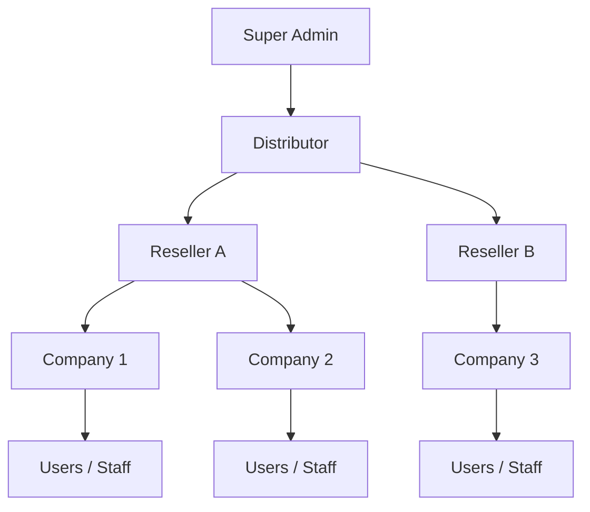

The IVT Platform is an enterprise-grade video surveillance and facial recognition system built for B2B deployments. It combines cloud-based management with edge computing to deliver real-time AI-powered facial recognition, intelligent video search, and centralized security operations across any number of sites and cameras.

## What Is the IVT Platform?

The IVT Platform serves as the backbone for organizations that need to monitor physical spaces, identify individuals using facial recognition, and manage security operations at scale. It is purpose-built for:

- **Security service providers** managing surveillance across multiple client sites
- **Enterprises** with large campus or multi-facility deployments
- **Distributors and resellers** offering managed video surveillance and facial recognition services
- **Access control operators** enforcing entry policies using face-based identification

## Key Capabilities

<CardGroup cols={2}>
  <Card title="Real-Time Video Monitoring" icon="video">
    View live camera feeds from any connected device. Monitor multiple cameras simultaneously across different locations from a single dashboard.
  </Card>
  <Card title="AI-Powered Facial Recognition" icon="face-viewfinder">
    Detect and recognize faces in real time using deep learning models. Match detected faces against enrolled galleries with configurable confidence thresholds.
  </Card>
  <Card title="Historic Footage Search" icon="clock-rotate-left">
    Search through recorded footage by date range, camera, zone, or person. Locate specific events or individuals across days or weeks of archived video.
  </Card>
  <Card title="Photo-Based Person Search" icon="image">
    Upload a photo of any individual and search across your entire camera network to find when and where that person has appeared.
  </Card>
  <Card title="Face Gallery Management" icon="address-book">
    Create categorized galleries of known faces for watchlists, access control, VIP lists, and blocklists. Enroll faces via photo upload or camera capture.
  </Card>
  <Card title="Zone-Based Geofencing" icon="map-location-dot">
    Define logical zones that group cameras by location, building, or operational boundary. Scope searches and alerts to specific zones.
  </Card>
  <Card title="Multi-Camera Support" icon="camera-cctv">
    Integrate cameras from Eagle Eye Networks cloud platform and any ONVIF-compliant devices. Manage all feeds through a unified interface regardless of hardware vendor.
  </Card>
  <Card title="Edge Computing with FMU Devices" icon="microchip">
    Deploy Facial Matching Unit (FMU) edge devices on-premises for low-latency AI processing. FMUs perform facial detection and matching locally, then sync results to the cloud.
  </Card>
</CardGroup>

## Architecture Overview

The IVT Platform uses a hybrid cloud-edge architecture that balances the scalability of cloud computing with the low-latency requirements of real-time facial recognition.

<Tabs>
  <Tab title="Cloud Platform">
    The cloud layer handles:
    - **User management** and authentication across the multi-tenant hierarchy
    - **Gallery storage** for enrolled face templates and metadata
    - **Search orchestration** across multiple FMU devices and camera feeds
    - **Dashboard and reporting** for security operations
    - **API services** for third-party integrations
    - **Configuration management** for cameras, zones, and policies

    The cloud platform is accessible via a web-based interface and a RESTful API.
  </Tab>
  <Tab title="Edge Devices (FMU)">
    Facial Matching Units (FMUs) are deployed on-premises at each monitored location:
    - **Local facial detection** extracts faces from camera streams in real time
    - **Template generation** converts detected faces into mathematical embeddings
    - **Gallery matching** compares detected faces against locally cached gallery data
    - **Result synchronization** pushes match events and metadata to the cloud
    - **Offline resilience** continues operating when cloud connectivity is interrupted

    FMUs reduce bandwidth requirements and ensure sub-second recognition latency.
  </Tab>
  <Tab title="Camera Layer">
    The platform integrates with cameras through two primary channels:
    - **Eagle Eye Networks (EEN):** Cloud-managed cameras connected via the EEN bridge. Video streams and recordings are managed through the EEN cloud.
    - **ONVIF Devices:** Standards-compliant IP cameras connected directly to FMU devices over the local network using the ONVIF protocol.

    Both camera types are managed uniformly within the platform interface.
  </Tab>
</Tabs>

## Multi-Tenant Hierarchy

The IVT Platform is built on a hierarchical multi-tenant model that supports complex organizational structures. Each level in the hierarchy inherits settings and policies from its parent while maintaining strict data isolation.

| Level | Description |
|---|---|
| **Super Admin** | Platform-wide administration. Manages all distributors, global settings, branding, and system configuration. |
| **Distributor** | Top-level business entity. Manages resellers and may directly manage companies. Controls feature allocation and billing boundaries. |
| **Reseller** | Intermediate entity that manages a portfolio of companies. Resellers can configure branding, provision companies, and manage user access within their scope. |
| **Company** | The operational unit where cameras, zones, galleries, and searches are configured. Each company has its own isolated data and user base. |
| **Users** | Individual accounts within a company. Users are assigned roles such as Company Admin, Security Officer, or Staff, each with different permission levels. |

<Info>
  Data is strictly isolated between tenants at every level. A reseller cannot access another reseller's companies, and a company's face galleries, search results, and camera feeds are never visible to other companies.
</Info>

## White-Label Branding

The IVT Platform supports full white-label customization, enabling distributors and resellers to present the platform under their own brand identity. The platform currently powers multiple branded experiences:

- **Verify** -- The primary IVT-branded experience
- **EEN (Eagle Eye Networks)** -- Co-branded integration with Eagle Eye Networks
- **Totalplay** -- Branded deployment for the Totalplay telecommunications network
- **Eye-D** -- A specialized identity-focused brand variant

Each brand can customize the platform logo, color scheme, login page, email templates, and documentation portal to match its corporate identity.

<Tip>
  White-label configuration is managed at the distributor or reseller level. If you need to set up or modify branding for your organization, contact your distributor administrator or refer to the [White-Label Configuration](/white-label/overview) guide.
</Tip>

## Next Steps

<CardGroup cols={2}>
  <Card title="Create Your Account" icon="user-plus" href="/getting-started/signing-up">
    Register and activate your IVT Platform account.
  </Card>
  <Card title="Understand Roles" icon="shield-halved" href="/getting-started/roles-and-permissions">
    Learn about the role-based permission system.
  </Card>
</CardGroup>
