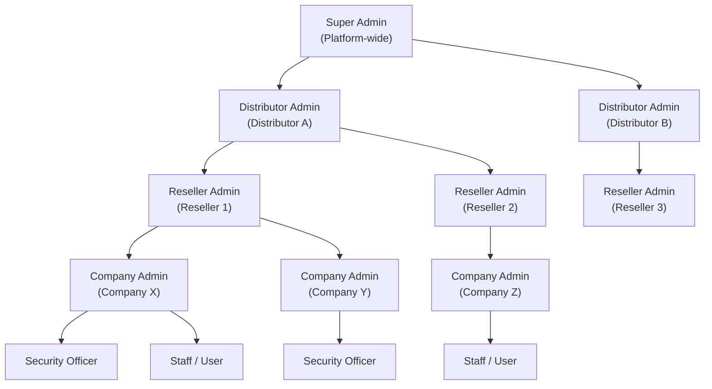

The IVT Platform uses a **role-based access control (RBAC)** system to govern what each user can see and do. Roles are assigned within the context of the multi-tenant hierarchy, meaning a user's permissions are scoped to their position in the organizational structure.

## Role Overview

The platform defines six primary roles, each with a different level of access and responsibility.

| Role | Scope | Description |
|---|---|---|
| **Super Admin** | Platform-wide | Full administrative control over the entire platform. Manages distributors, global settings, branding, and system configuration. |
| **Distributor Admin** | Distributor | Manages all resellers and companies under a distributor. Controls feature allocation, billing boundaries, and reseller provisioning. |
| **Reseller Admin** | Reseller | Manages a portfolio of companies under a reseller. Provisions companies, configures branding, and oversees company-level administration. |
| **Company Admin** | Company | Full administrative control within a single company. Manages users, cameras, zones, galleries, FMU devices, and company settings. |
| **Security Officer** | Company | Operational role focused on monitoring, searching, and responding to alerts. Can perform searches, manage galleries, and review alerts but cannot manage users or system configuration. |
| **Staff / User** | Company | Limited access role. Can perform basic searches and view alerts but cannot modify galleries, manage cameras, or access administrative functions. |

## Multi-Tenant Hierarchy

Roles operate within a hierarchical structure where each level has authority over the levels below it. Data isolation is enforced at every boundary -- a user at one level can never access data belonging to a peer at the same level.

<Info>
  Each node in the hierarchy is fully isolated from its peers. Distributor A cannot see Distributor B's data. Reseller 1 cannot access Reseller 2's companies. Company X's galleries and search results are invisible to Company Y.
</Info>

## Detailed Permission Matrix

The following table shows the specific actions each role can perform across the platform's major feature areas.

### User & Organization Management

| Action | Super Admin | Distributor Admin | Reseller Admin | Company Admin | Security Officer | Staff |
|---|---|---|---|---|---|---|
| Create / manage distributors | Yes | No | No | No | No | No |
| Create / manage resellers | Yes | Yes | No | No | No | No |
| Create / manage companies | Yes | Yes | Yes | No | No | No |
| Create / manage users | Yes | Yes | Yes | Yes | No | No |
| Assign roles | Yes | Yes | Yes | Yes | No | No |
| View audit log | Yes | Yes | Yes | Yes | No | No |

### Search & Surveillance

| Action | Super Admin | Distributor Admin | Reseller Admin | Company Admin | Security Officer | Staff |
|---|---|---|---|---|---|---|
| Perform real-time search | Yes | Yes | Yes | Yes | Yes | Yes |
| Perform historic search | Yes | Yes | Yes | Yes | Yes | Yes |
| Upload photo for search | Yes | Yes | Yes | Yes | Yes | Yes |
| View search results | Yes | Yes | Yes | Yes | Yes | Yes |
| Export search results | Yes | Yes | Yes | Yes | Yes | No |
| View live camera feeds | Yes | Yes | Yes | Yes | Yes | No |

### Gallery Management

| Action | Super Admin | Distributor Admin | Reseller Admin | Company Admin | Security Officer | Staff |
|---|---|---|---|---|---|---|
| Create galleries | Yes | Yes | Yes | Yes | Yes | No |
| Edit gallery metadata | Yes | Yes | Yes | Yes | Yes | No |
| Delete galleries | Yes | Yes | Yes | Yes | No | No |
| Enroll faces | Yes | Yes | Yes | Yes | Yes | No |
| Remove faces from gallery | Yes | Yes | Yes | Yes | Yes | No |
| View galleries | Yes | Yes | Yes | Yes | Yes | View Only |

### Infrastructure & Configuration

| Action | Super Admin | Distributor Admin | Reseller Admin | Company Admin | Security Officer | Staff |
|---|---|---|---|---|---|---|
| Manage cameras | Yes | Yes | Yes | Yes | No | No |
| Manage zones | Yes | Yes | Yes | Yes | No | No |
| Configure FMU devices | Yes | Yes | Yes | Yes | No | No |
| Manage company settings | Yes | Yes | Yes | Yes | No | No |
| Configure white-label branding | Yes | Yes | Yes | No | No | No |
| Manage platform-wide settings | Yes | No | No | No | No | No |

## How Role Assignment Works

Roles are assigned by administrators at the appropriate level of the hierarchy.

<Steps>
  <Step title="Administrator Creates a User">
    An administrator (Company Admin or higher) creates a new user account by providing the user's name, email, and initial role. The system sends an invitation email to the new user.
  </Step>
  <Step title="Role Is Assigned During Creation">
    The role is selected during user creation. The available roles depend on the administrator's own position in the hierarchy:
    - A **Company Admin** can assign: Company Admin, Security Officer, or Staff
    - A **Reseller Admin** can assign: Company Admin, Security Officer, or Staff (within their companies)
    - A **Distributor Admin** can additionally assign: Reseller Admin
    - A **Super Admin** can assign any role, including Distributor Admin
  </Step>
  <Step title="Role Can Be Modified">
    After creation, an administrator can change a user's role at any time from the user management screen. Role changes take effect on the user's next login or page refresh.
  </Step>
</Steps>

<Warning>
  Changing a user's role immediately affects their access. If you downgrade a user from Company Admin to Staff, they will lose access to administrative functions. Always confirm role changes with the affected user before applying them.
</Warning>

## Role Scope and Data Visibility

Each role's data visibility is scoped to its position in the hierarchy:

<AccordionGroup>
  <Accordion title="Super Admin">
    Sees all data across the entire platform. Can switch between any distributor, reseller, or company context. Has access to platform-level configuration, global audit logs, and system health monitoring.
  </Accordion>
  <Accordion title="Distributor Admin">
    Sees all resellers and companies under their distributor. Can switch between companies within their distributor scope. Cannot see data belonging to other distributors.
  </Accordion>
  <Accordion title="Reseller Admin">
    Sees all companies under their reseller. Can switch between companies within their reseller scope. Cannot see other resellers' data or access distributor-level settings.
  </Accordion>
  <Accordion title="Company Admin">
    Sees all data within their assigned company. Has full control over users, cameras, zones, galleries, and settings within that company. Cannot see data from other companies.
  </Accordion>
  <Accordion title="Security Officer">
    Sees operational data within their company: search results, alerts, camera feeds, and galleries. Cannot access user management, system configuration, or audit logs.
  </Accordion>
  <Accordion title="Staff / User">
    Sees a limited view within their company. Can perform searches and view alerts. Can view galleries in read-only mode. Cannot manage cameras, zones, users, or system settings.
  </Accordion>
</AccordionGroup>

## Best Practices

<Tip>
  Follow the **principle of least privilege** when assigning roles. Give each user the minimum level of access they need to perform their job function. This reduces the risk of accidental misconfiguration and improves overall platform security.
</Tip>

- Assign the **Staff** role to employees who only need to perform basic lookups and view alerts
- Reserve the **Security Officer** role for personnel responsible for active monitoring and gallery curation
- Use **Company Admin** for IT staff and security managers who need to configure cameras, zones, and users
- Limit **Reseller Admin** and **Distributor Admin** roles to partner management personnel
- Review role assignments periodically and revoke access for users who have left the organization or changed responsibilities

## Next Steps

<CardGroup cols={2}>
  <Card title="Navigate the Platform" icon="compass" href="/getting-started/navigating-the-platform">
    See how the interface adapts based on your role.
  </Card>
  <Card title="User Management" icon="users-gear" href="/administration/user-management">
    Learn how to create, edit, and manage user accounts.
  </Card>
</CardGroup>
